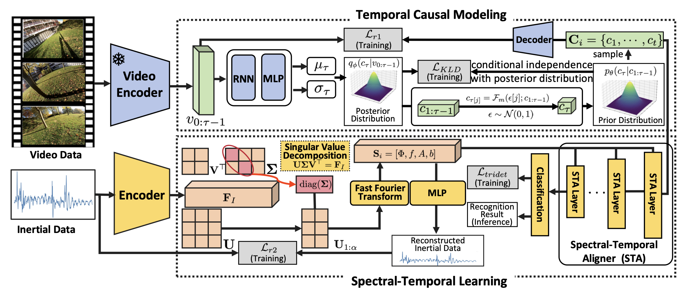
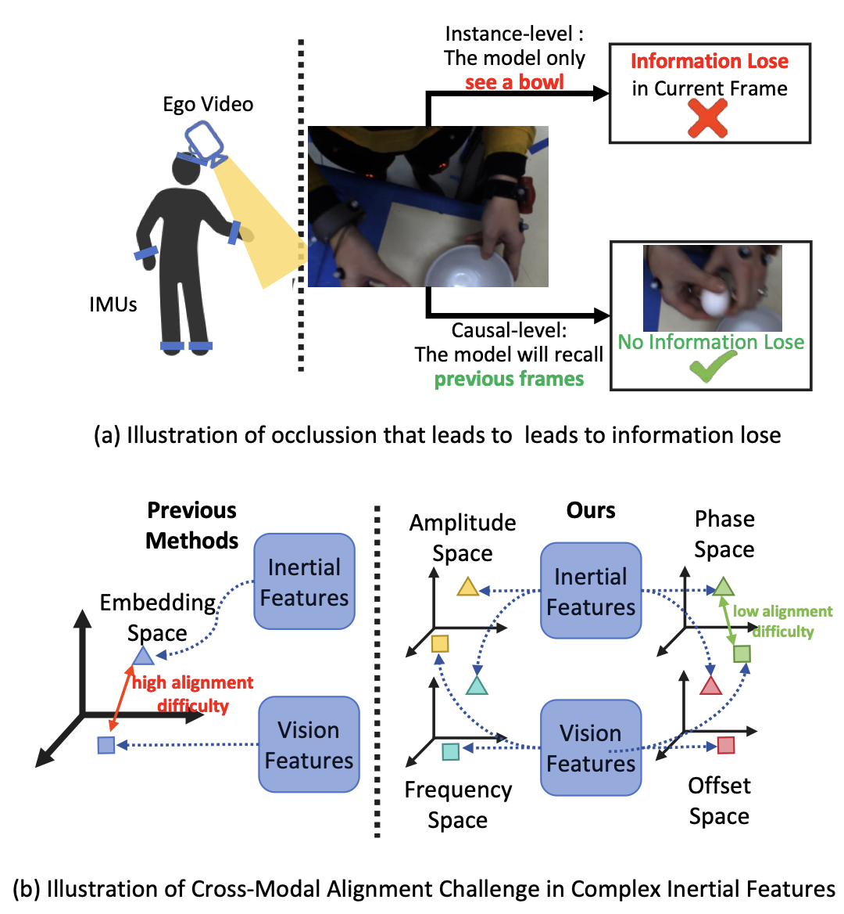
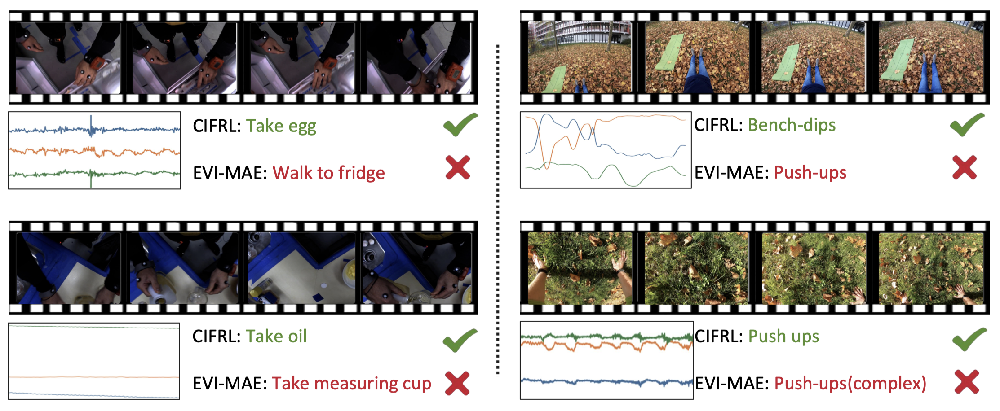

## Introduction

This is the source code of "Causal-Inspired Fourier Representation Learning for Wearable IMUs and Egocentric Action Recognition"

## Causal-Inspired Fourier Representation Learning for Wearable IMUs and Egocentric Action Recognition

The CIFRL framework comprises two key components: 

1. **Temporal Causal Modeling (TCM)**, which employs causal learning to model causal relationships among video features. This component effectively captures visual changes over time and the dependencies between successive frames, enhancing the model's ability to understand dynamic visual contexts.
2. **Spectral-Temporal Learning (STL)**, which leverages Fourier representation learning to extract salient features from inertial data. 

## Proposed Model (CIFRL)



* *Temporal Causal Modeling (TCM)*
* *Spectral-Temporal Learning (STL)*

## Motivation



Illustrative examples of: (a) instance-level representation and causal-level representation. (b) complex inertial data alignment challenge.

## Recognition Examples



## Usage

```shell
python main.py --config <your_config_path> 
```

